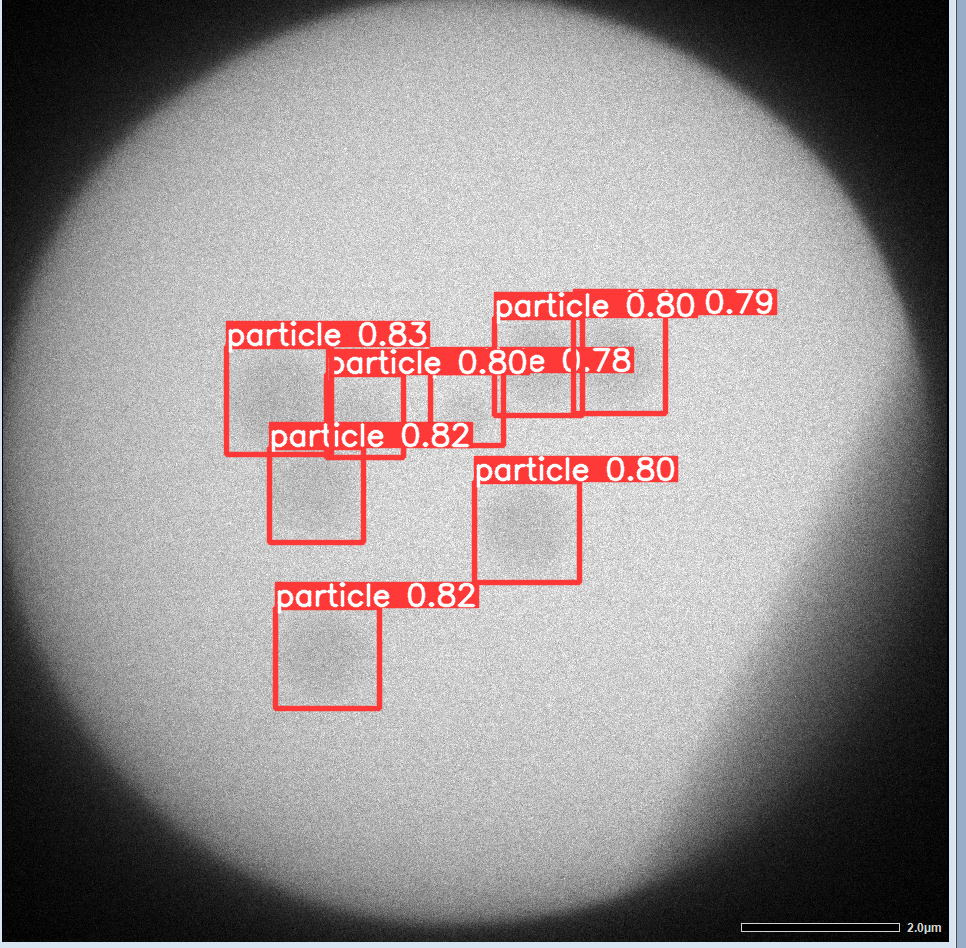

# Early-Detection-of-Nucleation-Events-LC-TEM

- weights/params.pt 
Model parameter of yolov5s used in ["Early Detection of Nucleation Events From Solution in LC-TEM by Machine Learning"](https://doi.org/10.3389/fchem.2022.818230).

## Setup

See the [official page](https://github.com/ultralytics/yolov5).

## Detect
`
$ python detect.py --source images/val/0032.bmp --weights weights/params.pt
`

The result will be created in the new folder such as runs/detect/exp.

## Dataset 

The dataset for training is available in the Zenodo: [10.5281/zenodo.6948105](https://doi.org/10.5281/zenodo.6948105).

The directry structure is:

images
 |
 +-train
 |  +-0000.bmp 
 |  +-0001.bmp
 |      :
 +-val
    +-0000.bmp 
    +-0001.bmp
        :

labels
 |
 +-train
 |  +-0000.txt
 |  +-0001.txt
 |      :
 +-val
    +-0000.txt
    +-0001.txt
        :

## Citation
Hiroyasu Katsuno, Yuki Kimura, Tomoya Yamazaki and Ichigaku Takigawa, Front. Chem. **10** (2022) 818230 (doi:[10.3389/fchem.2022.818230](https://doi.org/10.3389/fchem.2022.818230)).

### License
MIT License.

