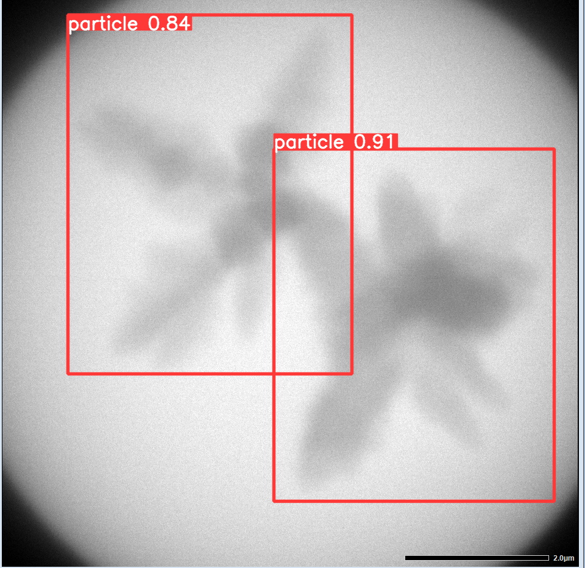

# Early-Detection-of-Nucleation-Events-LC-TEM

Model parameter of yolov5s used in ["Early Detection of Nucleation Events From Solution in LC-TEM by Machine Learning"](https://doi.org/10.3389/fchem.2022.818230).

## Setup

See the [official page](https://github.com/ultralytics/yolov5).

## Detect
`
$ python detect.py --source images/val/0000.bmp --weights weights/params.pt
`

The result will be created in the new folder such as runs/detect/exp.

### Dataset 

The dataset for training will be opened.

## Citation
Hiroyasu Katsuno, Yuki Kimura, Tomoya Yamazaki and Ichigaku Takigawa, Front. Chem. (2022) (doi:[10.3389/fchem.2022.818230](https://doi.org/10.3389/fchem.2022.818230)).

### License
MIT License.

